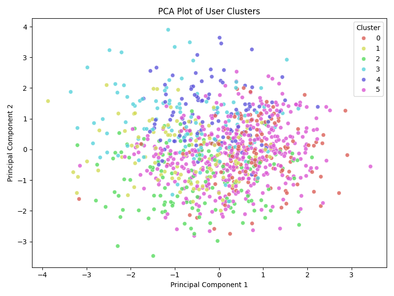
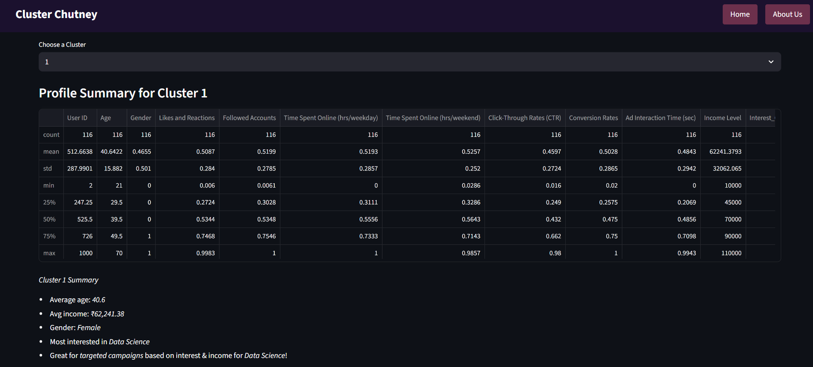

# Cluster Chutney

**Cluster Chutney** is a visual, interactive user segmentation dashboard built using **Streamlit** and **unsupervised machine learning (KMeans)**. It enables teams to explore, analyze, and cluster users based on demographics, behavior, and interests to power personalized recommendations, targeted ads, and strategic user insights.


## Key Features

- **Upload & Clean Data**
  - Upload a user dataset (CSV) and automatically clean, encode, and prepare it for clustering.

- **EDA (Exploratory Data Analysis)**
  - Visualize age, income, time spent online, interests by gender, and correlation heatmaps.
  - Toggle between charts to explore dataset distributions.

- **KMeans Clustering**
  - Supports both auto-detection of optimal `K` via Elbow Method + Silhouette Score and manual selection.
  - Visualizes clusters using PCA plots and interactive cluster previews.

- **Cluster Profiles**
  - Generate interpretable summaries per cluster: average age, income, top interests, gender skew.
  - Export segmented data per cluster.


## Tech Stack

| Layer        | Technologies                                  |
|--------------|-----------------------------------------------|
| UI/Frontend  | Streamlit                                     |
| Data Science | pandas, numpy, scikit-learn, matplotlib, seaborn |
| Clustering   | KMeans, PCA                                   |
| Deployment   | Streamlit Share / Local Python Environment    |

## Project Structure

```bash
Cluster_Chutney/
│
├── app.py                     # Main Streamlit dashboard
├── requirements.txt           # Python packages needed
│
├── data/
│   └── users.csv              # Sample dataset
│
├── models/
│   └── cluster_model.pkl      # Serialized clustering model (joblib)
│
├── modules/
│   ├── data_processing.py     # Cleaning, encoding utilities
│   ├── eda_visuals.py         # EDA plots: histograms, heatmaps, bar plots
│   └── after_visuals.py       # PCA scatter, centroid heatmaps, summaries
│
├── assets/
│   └── visuals/               # Auto-generated chart images
│
└── README.md
```

## Getting Started

### 1. Clone the repository

```bash
git clone https://github.com/Veenbeans/Cluster-Chutney.git
cd Cluster-Chutney
```

### 2. Install dependencies

```bash
.venv\Scripts\activate
pip install -r requirements.txt
```

### 3. Run the app

```bash
streamlit run app.py
```

App will open in your browser at `http://localhost:8501`.

## Screenshots
1. Home Page – Shows the hero section with the title “Cluster Chutney” and dataset upload button.

2. Uploaded Dataset Preview – Displays a preview of the uploaded CSV file in a scrollable table.

3. EDA Visualizations – Time Spent Online (Weekday vs Weekend) visualized with clean plots.

4. EDA Visualizations - Age Distribution  
  
5. EDA Visualizations - Gender vs Top Interests  
  
6. Clusters tab Auto - Here we Use Elbow Method (Auto)

7. PCA Cluster Visualization  
  
8. Clusters tab Visualisations - It shows us the visualisations of the clusters in the data.

9. Profile tab - Choosing the cluster whose summary we want to see.

10. Cluster wise Summary – Shows a human-readable summary of each cluster’s key traits like age, income, and interests.

11. Footer Section – Displays team member credits and project links.


## How It Works

1. **Data Upload**  
   Upload a `.csv` file with demographic and behavioral features.

2. **EDA Tab**  
   Select charts to explore distribution across features.

3. **Clusters Tab**  
   Choose `K` manually or auto-select via Elbow Method. View PCA visualization, centroid heatmaps, and clustered data.

4. **Profiles Tab**  
   Pick a cluster to see average age, gender split, top interest, income, and export the segment.

## Export Options

- Download **clustered dataset** (`.csv`)
- Export **individual cluster segments**
- Save **charts & heatmaps** as PNG from `assets/visuals/`

## Project Team

<p align="left">
  
  
  
  
</p>

- **Sri Sai Lahari** – [LahariRachapudi](https://github.com/LahariRachapudi)  
- **Abhishek Karthik** – [Abhishek18004](https://github.com/Abhishek18004)  
- **Sai Sushanth Guddeti** – [Aurus7900](https://github.com/Aurus7900)  
- **Veenasree Krishna** – [Veenbeans](https://github.com/Veenbeans)

## Inspiration

Born from the need to **understand user behavior for targeted outreach**, Cluster-Chutney is a dashboard-first tool that makes data science accessible for business and marketing professionals.
